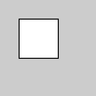
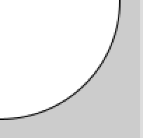
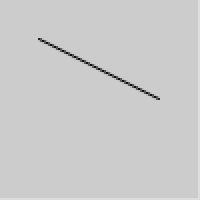
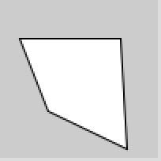

Spiekbriefje met veelgebruikte Processing-instructies.

<!--more-->

Het spiekbriefje is ook als [Processing_spiekbriefje.pdf](Processing_spiekbriefje.pdf) te downloaden.

Als je eerst nog wat meer uitleg wil over kunst maken met Processing, kun je deze uitleg downloaden: [Processing3-Coderdojo-Nm.pdf](Processing3-Coderdojo-Nm.pdf).

## Basis van een Processing-script


void setup() {  // één keer doen
}
void draw() {   // steeds opnieuw
}


## Vormen

### Rechthoek


rect(20, 20, 40, 40);

rechthoek

### Ellips


ellipse(0, 0, 80, 40);  

ronde vorm van 80 pixels breed en 40 hoog

### Lijn


line(20, 20, 80, 50);

rechte lijn met beginpunt 20,20 en eindpunt 80,50

### Vierhoek


quad(152, 124, 344, 80, 276, 252, 120, 304);

vierhoek

### Andere vormen
* `arc(50, 50, 80, 80, PI);` halve cirkel
* `curve` gebogen lijnen
* `bezier` nog meer gebogen lijnen
* `beginShape`, `vertex` en `endShape` complexe vormen

## Kleur

* `background(255);` achtergrondkleur
* `fill(100);` inkleuren
* `noFill();` niet inkleuren
* `stroke(30);` kleur van randen
* `strokeWeight(5);` dikte van randen
* `noStroke();` geen randen
  
Voorbeelden:

* `fill(200);` één getal is een grijswaarde tussen zwart (0) en wit (255)
* `fill(255, 20);` twee getallen: grijswaarde en doorzichtigheid
* `fill(255, 40, 200);` drie getallen: rood, groen en blauw mengen
* `fill(255, 100, 100, 30);` rood, groen, blauw en doorzichtigheid

## Grootte van het Processing-scherm

* `size(200, 200);` grootte scherm opgeven
* `fullScreen();` scherm beeldvullend maken
* `width` breedte van scherm als variabele
* `height` hoogte van scherm als variabele

Het midden van het scherm vind je door width en height door tweeën te delen:
* `rect(width/2, height/2, 40, 40);`

## Muis en toetsenbord

* `mouseX` horizontale positie van je muis
* `mouseY` verticale positie van je muis

Deze woorden kun je gebruiken in een if-statement of als functie:
* `mousePressed` ‘true’ als je op muis klikt
* `mouseDragged` ‘true’ als je muis over het scherm sleept
* `mouseMoved` als de muis beweegt zonder dat de knop is ingedrukt
* `keyPressed` ‘true’ als je typt
* `key` variabele met de laatst getypte toets

## Variabelen

In verschillende variabelen kun je verschillende soorten informatie bewaren:

* `int` hele getallen, positief of negatief
* `float` decimale getallen
* `boolean` waar/niet waar, ‘true’ of ‘false’
* `string` een tekst
* `char` een enkele letter
* `color` een kleur

* `int getal = 10;`
* `float variabele1 = 3.01;`

## Vragen stellen

* `if (voorwaarde) { .. }` if-statement


// zijn het er meer dan 10?
if (aantal > 10) {
    // zo ja, doe dan hier iets
}


* `<` kleiner dan
* `>` groter dan
* `==` gelijk aan
* `!=` niet gelijk aan

## Iets meerdere keren doen

* `while (voorwaarde) { .. }` while loop: blijf iets doen zolang de voorwaarde waar is
* `for (int i=0; i < 10; i++) { .. }` for-loop (in dit voorbeeld): begin bij 0, ga door zolang we nog niet bij 10 zijn, en tel er steeds 1 bij op.

## Steeds anders

* `random()` kies een willekeurig getal
* `noise()` willekeurig, maar wel steeds dichtbij het getal ervoor
* `frameCount` aantal beeldjes in de animatie tot nu toe

## Het canvas verschuiven of draaien


float r;        // variabele

void setup() {
    rectMode(CENTER);
}

void draw() {
    background(51);
    translate(width/2, height/2);
    rotate(r);  // draaiing
    rect(0, 0, 60, 60);

    // klein beetje verder draaien
    r += 0.02;
}


* `rotate(0.1);` draai het canvas rond 0,0
* `translate(300, 300);` verplaats het beginpunt van het canvas (dus 0,0) van linksbovenin naar ergens anders (bijvoorbeeld het midden).
* `pushMatrix();` onthou alle rotates en translates die hierna komen
* `popMatrix();` maak alle rotates en translates ongedaan voor alles wat hierna komt.

## Nummers passend maken met map()

Waarde (bijvoorbeeld de muispositie) ‘vertalen’ naar een ander bereik:  
`float h = map(mouseX, 0, width, 40, 300);`

## Afstand tot een bepaald punt met dist()


void draw() {
    float d = dist(50, 50, mouseX, mouseY);
    float gray = map(d, 0, 100, 0, 255);
    fill(gray);
    rect(0, 0, width, height);
}


## Tekst invoegen


textSize(20);
text("tekst komt", 6, 20);
textSize(50);
text("hier", 6, 70);


## Plaatjes inladen


PImage foto;    // variabele

void setup() {
    size(400, 400);
    // laad een plaatje in die in
    // dezelfde map staat als dit script
    foto = loadImage("foto.jpg");
}

void draw() {
    // laat het plaatje zien
    image(foto, 0, 0);
}


## Golfbewegingen met sinus

Gebruik sin() en cos() om golvende veranderingen te krijgen:

float hoek = 0; // variabele void draw( ) {
background(0);
// sinus gebruiken als grootte circle(50, 50, sin(hoek)*100);
// hoek een klein beetje veranderen hoek += 0.02;
}


## Meer informatie en inspiratie

Dit zijn nog lang niet alle functies in Processing! Op https://processing.org/reference vind je alle functies mét uitleg.

Mooie voorbeelden van wat er allemaal kan met Processing zie je op
* https://processing.org/examples
* https://openprocessing.org
* https://reddit.com/r/processing
* http://generative-gestaltung.de/2/

## Probeer het!

1. Maak een vierkant dat steeds opnieuw getekend wordt op de plek van je muis. Teken steeds een nieuwe achtergrond in draw() met een kleur die verandert met de muispositie.

2. Teken een puntje op de plek waar de muis is. Zet geen background() in draw(). Probeer het ook met andere vormen en kleuren, ook met half-doorzichtige.
Kun je een tweede vorm maken die in omgekeerde richting beweegt?

3. Teken een vorm die van heel klein steeds een beetje groter wordt (met een variabele, niet op basis van de muis). Laat hem opnieuw klein beginnen als je op de muis klikt óf als hij groter wordt dan de breedte van het scherm.
Gebruik dezelfde variabele ook om de positie en kleur te veranderen.

4. Teken een stuk of 10 vierkantjes onder elkaar. Laat ze horizontaal mee-veranderen met de muispositie, maar zorg dat elk vierkantje dat nèt iets anders doet. (Tip: je kunt getallen bij mouseX optellen, maar mouseX ook vermenigvuldigen en delen! Vermenigvulden doe je met * en delen met /.)

5. Maak confetti! Teken steeds een nieuwe kleine cirkel op steeds een andere plek met steeds een andere kleur. (Tip: gebruik random() voor de x- en y-positie én voor de kleuren. Probeer ook een donkere achtergrond!)

6. Teken een bijna helemaal doorzichtig rondje met dikke rand op een lichte achtergrond. Teken die achtergrond niet in draw().

7. Maak een bloem met overlappende cirkels!

8. Schrijf een woord steeds ergens anders op het scherm, met steeds een andere kleur.

9. Schrijf smileys met tekst (:-)) met een gele cirkel eromheen, steeds op een andere plek.
(Probeer het eerst op de simpelste manier. Als je daarna ook nog translate() en rotate() gebruikt, dan kun je de smileys ook nog om hun as laten draaien!)

10. Teken een vorm die steeds van plek verandert. Als hij bij de randen aankomt, laat hem dan van kleur veranderen en een andere kant op gaan. (Hier heb je variabelen bij nodig om de x- en y-positie van je vorm op te slaan, en een paar if-statements.)

11. Teken twee vormen naast elkaar. De grootte van de ene is afhankelijk van de muispositie, die van de andere van de muispositie min ongeveer de helft van de breedte van het scherm.

12. Teken een cirkel die van kleur verandert als je dichterbij komt.
(Tip: dit is het makkelijkst met dist().)

13. Teken 8 cirkels die in elkaar zitten. (Tip: gebruik een while-loop of for-loop.)

14. Maak een spiraal! Gebruik translate() en rotate() om vormen niet alleen verder weg te laten bewegen, maar ook steeds verder van een middelpunt af te tekenen.

15. Teken een bijna helemaal doorzichtige lijn helemaal van bovenaan het scherm naar onderaan. Gebruik je muis als horizontale positie. Teken geen achtergrond in draw().

16. Verplaats het beginpunt van je canvas naar ergens met translate(), laat het canvas steeds een klein beetje ronddraaien met rotate() en teken een of meer rechthoeken.

17. Teken heel veel kleine rondjes naast elkaar en verander elke keer de kleur een klein beetje. Probeer ze in een cirkel te laten tekenen met rotate()!

18. Teken meerdere vormen waarvan je de positie (of draaiing) met een sinus-functie bepaalt.

19. Maak een soort zon door driehoeken en lijnen rond een middelpunt te tekenen. (Tip: gebruik translate() en rotate().)

Verder variëren met
* Vorm
* Grootte
* Kleur (en doorzichtigheid)
* Positie
* Beweging (snelheid en richting)
* Rotatie
* Aantal
* Blijvend in beeld of niet
* Input van het toetsenbord

Probeer ook tekst, image, video, webcam en sound!
Zie de voorbeeld-scripts in Processing onder het menu Bestand > Voorbeelden.


